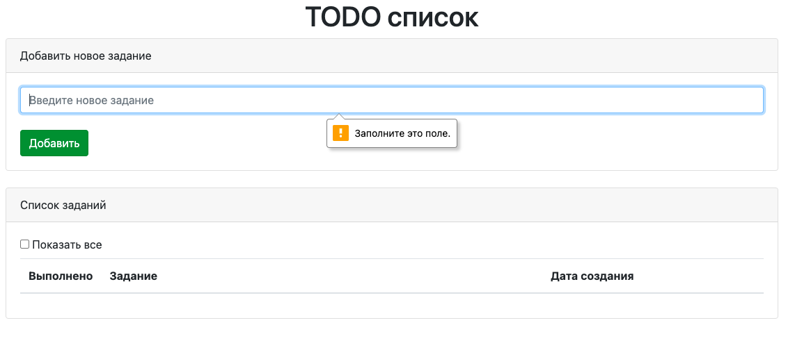
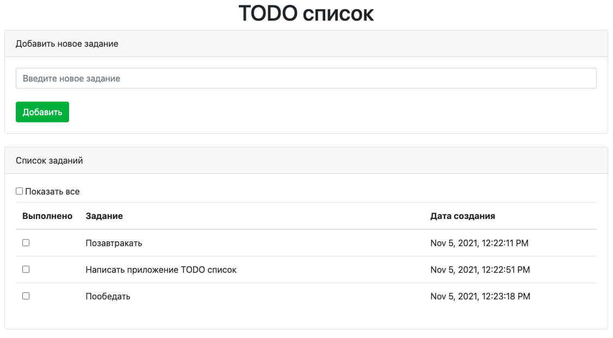
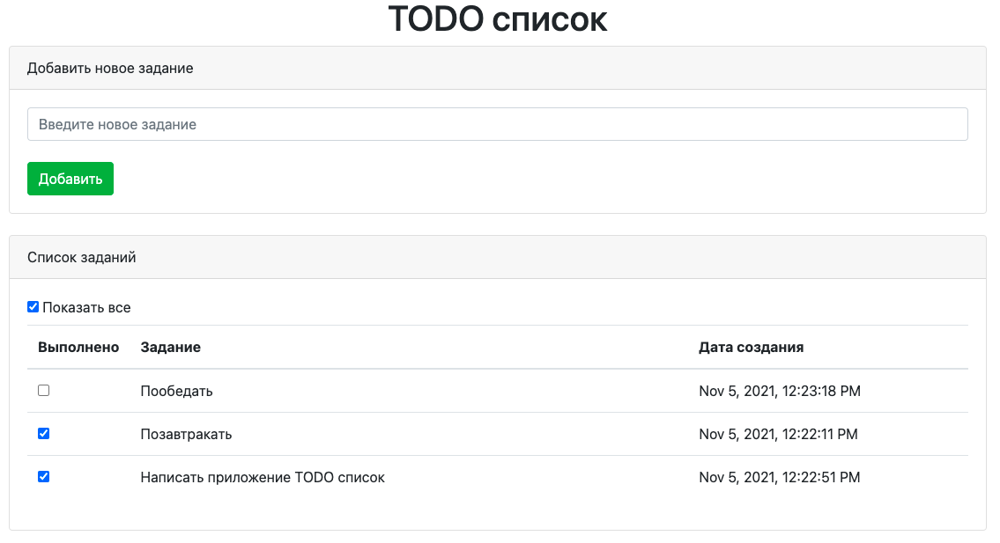
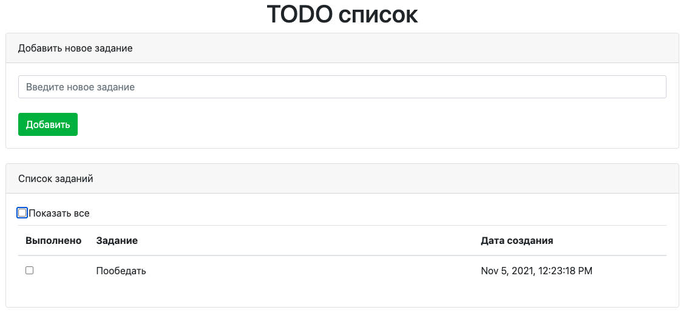

# TODO - лист.

## О проекте:

Приложение TODO-лист - список поставленных задач.
Задачи добавляются в список, если задача выполнена - она исчезает
из списка. Если включена функция "показать все" - будут показаны
все задачи, как выполненные, так и текущие.

#### Использованы технологии:

- Java EE Servlets API
- Hibernate
- PostgreSQL
- HTML, CSS
- JavaScript (jQuery, AJAX)
- Maven
- Travis CI
- Apache Tomcat

## Сборка и установка:
Сборка проекта с помощью Maven в WAR-архив для последующего
развертывания в контейнере сервлетов (Apache Tomcat и т.п.).

`mvn inslall`

Скрипты для базы данных: db/schema.sql

## Контакты:
Если у вас есть какие-либо вопросы, не стесняйтесь обращаться ко мне:

Евгений Зайцев

[cyberfuzzapps@gmail.com](mailto:cyberfuzzapps@gmail.com)
