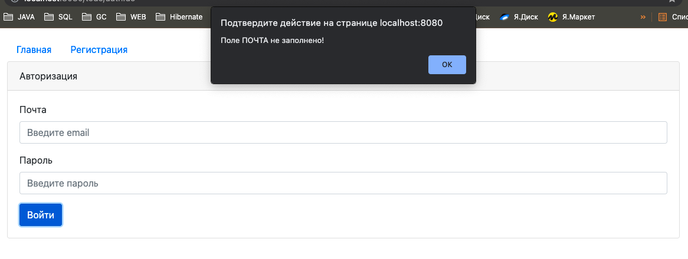
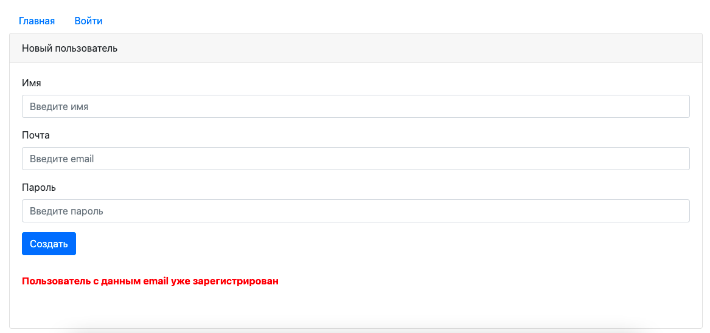
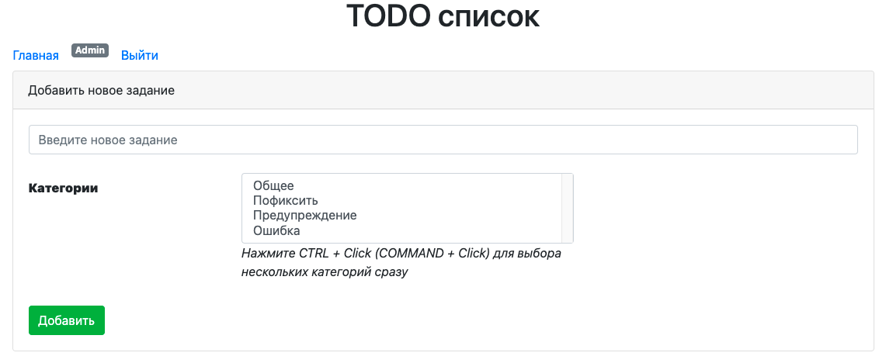
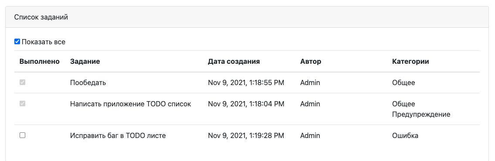

# TODO - лист.

## О проекте:

Приложение TODO-лист - список поставленных задач.
Задачи добавляются в список, если задача выполнена - она исчезает
из списка. 

#### Использованы технологии:

- Java EE 
- Servlets API
- Hibernate / JPA
- PostgreSQL
- HTML, CSS
- JSP, JSTL
- JavaScript (jQuery, AJAX)
- Maven
- Travis CI
- Apache Tomcat

## Как использовать:

Пользователь должен зарегистрироваться и авторизоваться (есть 
формы регистрации и авторизации). После авторизации пользователю 
будет показан список текущих задач. Если включена функция "показать все" - будут показаны
все задачи, как выполненные, так и текущие. Задача состоит из:

- статуса выполнения
- описания задачи
- даты создания
- автора задачи
- списка категорий задачи

Можно добавлять новые задачи и присваивать им категории.

## Сборка и установка:
Сборка проекта с помощью Maven в WAR-архив для последующего
развертывания в контейнере сервлетов (Apache Tomcat и т.п.).

`mvn install`

Скрипты для базы данных: db/schema.sql

## Контакты:
Если у вас есть какие-либо вопросы, не стесняйтесь обращаться ко мне:

Евгений Зайцев

[cyberfuzzapps@gmail.com](mailto:cyberfuzzapps@gmail.com)
